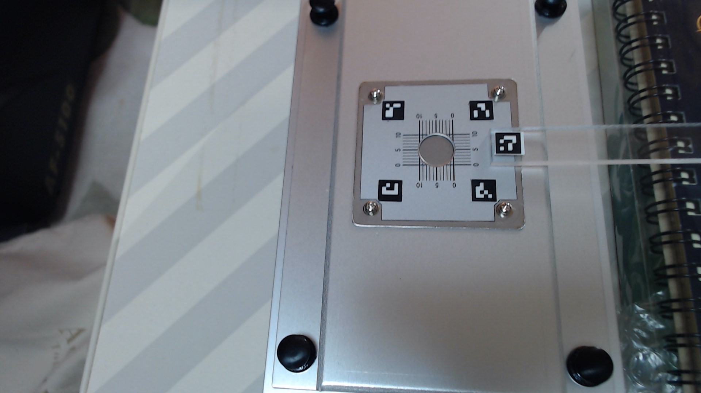
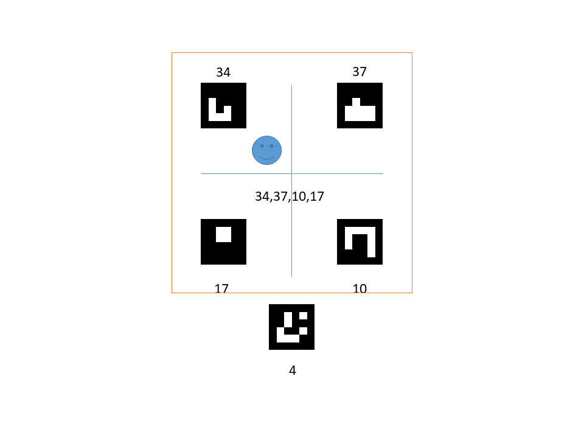
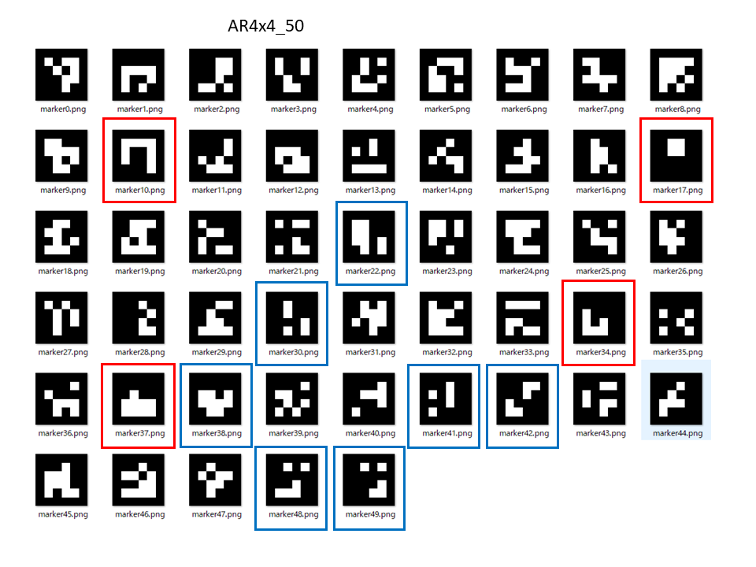
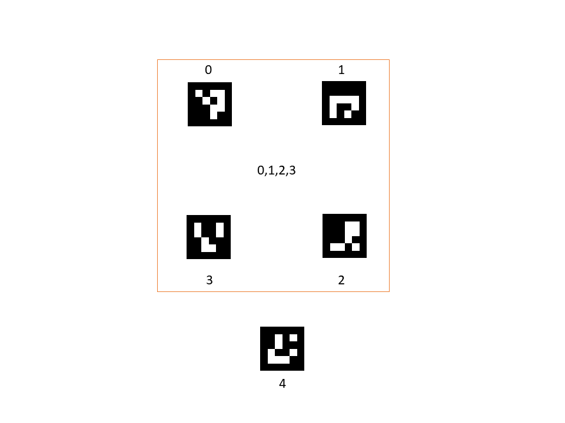
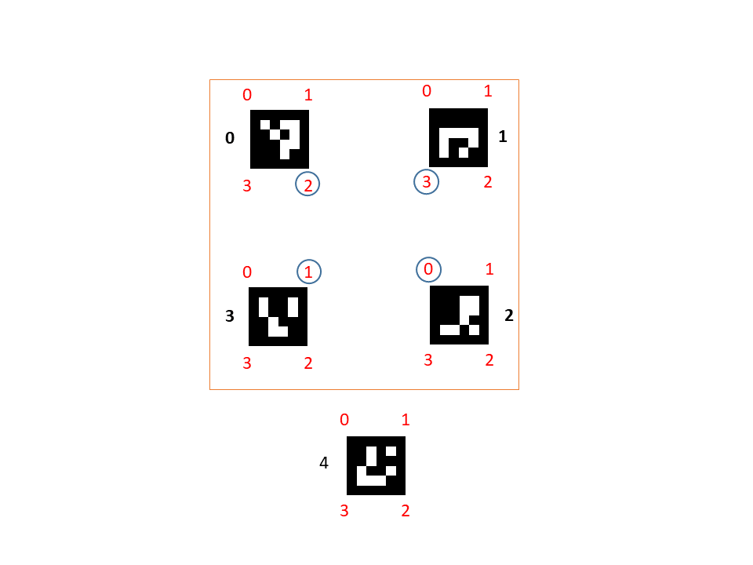

## ARマーカーを用いた位置情報の取得


### はじめに
マーカーを利用した、位置情報の取得や台形補正などが行われている。
例えば、[マーカーを利用した傾き補正](https://nixeneko.hatenablog.com/entry/2016/01/21/163937)では、同心円状のマーカ（弓道の的）を四隅に配置して各マーカーん座標を読み取り、変換するサイズを指定して、射影変換を行い台形補正を行っている。また、[Python+OpenCVで、カメラ画像から机上の物体位置（実座標系）を計測してみる](https://qiita.com/code0327/items/c6e468da7007734c897f)では、ARマーカーを利用して台形補正を行っている。

測定試料ホルダーに4つのARマーカーを配置するとともに、測定する位置に5個目のARマーカーを取り付けることで、画像処理で測定位置を推定することを試みた。（試料ホルダーが動いたときにどの位置を測定しているかがわかる）



例えば、上の図のように0から3番のARマーカーを4角に配置して、4番のARマーカーのセンターの位置が測定位置に設定する。サンプルが動くと0から3番と4番の位置関係が変わるので、測定位置を推定することができる。

また、カメラで斜めから撮影しても射影変換を行うことで真上からの視野に変形することができる。

測定試料ホルダーに使う場合（テプラのようなシールでなく、ホルダーに直接加工する場合）、より単純なARマーカーの方が良いので、単純な形のARマーカーを50個のリストから選び出し、図のように配置した。


50このARマーカーリストは下図の通りである。


参考にしたサイトでは、ARマーカーの0~3を用いていたが、今回のように自由にARマーカーをを選んで配置した場合に対応するためにプログラムの修正を行った。また、測定位置の座標も推定できるようにしている。

### その他参考

[ARマーカー認識プログラム](https://qiita.com/hsgucci/items/37becbb8bfe04330ce14)

[Python, OpenCVで幾何変換（アフィン変換・射影変換など）]
(https://note.nkmk.me/python-opencv-warp-affine-perspective/)

https://watlab-blog.com/2019/06/01/projection-transform/


### 環境と環境構築
試した環境

Win10 Pro 64bit

Anaconda

Python3.7

#### モジュールインストール

opencv : version4 以上  

```Python
conda install -c conda-forge opencv
pip install pyzbar
```
conda-forgeからインストールできます。
(conda-forgeからのインストールが設定されている場合は、-c conda-forge　は不要です。）

QRコードリーダーはpipからインストールしてください。
```Python
pip install pyzbar
```


### 使い方

テスト画像"ar1.PNG"では、4角を決めるARマーカーIDは、0から3。位置指定のARのIDは4。

テスト画像"ar2.PNG"では、4角を決めるARマーカーIDは、34,37,10,17。位置指定のARのIDは4。

テスト画像に合わせて、size=(150,150), AR_ids_list=[34,37,10,17], position_num=4,　を変更する。

なお、sizeは下図の青まるで囲まれている数字の間のピクセル数を指定している。



ARマーカーをリアルタイムにUSBカメラで認識する関数
ar_find_realtime.py

```python
live_find()    
```
ARマーカーが4つ以上見つかったら画像を保存する関数
```python
live_find_save()

```
ARマーカーが4つ以上見つかったら射影変換を行い、5つ目のARマーカーの位置を推定する関数

size=(150,150), AR_ids_list=[34,37,10,17], position_num=4
を指定する必要がある。
```python
 live_find_transform(camera_num=0, time_out=0, save_image=False, out_img_path="./data",
                        size=(150,150), AR_ids_list=[34,37,10,17], position_num=4)
```

4つ以上ARマーカーが写っているファイル(ar1.PNGなど）から射影変換を行い、5つ目のARマーカーの位置を推定する。
ar_fined_file.py

```python
if __name__ == "__main__":  # 以下に例題を表示
    image_file = './photos/ar2.PNG'
    artest = ArFind(image_file, size=(150, 150), output_path='./data', 
                    holder_AR_ids_list=[34,37,10,17],position_num=4, plot_flag=True)
    artest.find_ids()
    artest.find_ids_overlay(info=True,img_save=True)
    a,b = artest.image_conversion(size=(150,150),info=True, image_save=True, ar_cut_position='edge')
    print(a)
    print(b)
```

### その他
QRコードについてはqr_libに関数がまとまっています。
