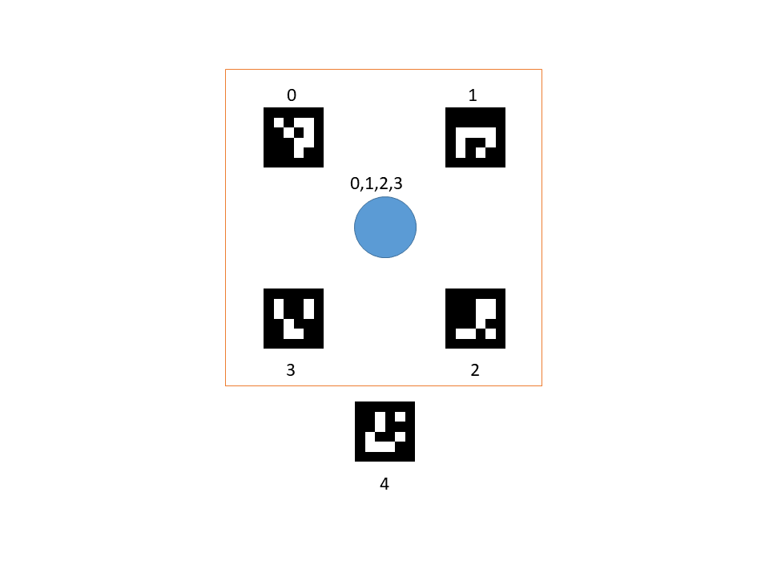

## ARマーカーを用いた位置情報の取得


### はじめに
ARマーカーを4つ配置して、各ARマーカーの座標を読み取り、画像サイズ（ピクセル）を設定し、射影変換を行い実座標系における位置計測を行う。
この方法を応用して、ARマーカーを正方形の4角に配置した試料ホルダーを作成し、5番目のARマーカーで測定位置を指定するような位置決め方式を試してみる。（試料ホルダーが動いたときにどの位置を測定しているかがわかる）



例えば、上の図のように0~3番のARマーカーを4角に配置して、4番のARマーカーのセンターの位置が測定位置に設定する。サンプルが動くと0~3番と4番の位置関係が変わるので、測定位置を推定することができる。

また、カメラで斜めから撮影しても射影変換を行うことで真上からの視野に変形することができる。

サンプルホルダーに使う場合、より単純なARマーカーの方が良いので、単純な形のARマーカーを50個のリストから選び出し、図のように配置した。


### 参考
[Python+OpenCVで、カメラ画像から机上の物体位置（実座標系）を計測してみる](https://qiita.com/code0327/items/c6e468da7007734c897f)

[ARマーカー認識プログラム](https://qiita.com/hsgucci/items/37becbb8bfe04330ce14)

### 環境と環境構築
試した環境

Win10 Pro 64bit

Anaconda

Python3.7

#### モジュールインストール

opencv : version4 以上  

```Python
conda install -c conda-forge opencv
pip install pyzbar
```
conda-forgeからインストールできます。
(conda-forgeからのインストールが設定されている場合は、-c conda-forge　は不要です。）

QRコードリーダーはpipからインストールしてください。
```Python
pip install pyzbar
```


### 使い方

ARマーカーを4つ配置して、各ARマーカーの座標を読み取り画像サイズ（ピクセル）を設定し、射影変換をすることにより実座標系における位置計測を行う。

テスト画像"ar1.PNG"では、4角を決めるARマーカーIDは、0から3。位置指定のARのIDは4。
テスト画像"ar2.PNG"では、4角を決めるARマーカーIDは、34,37,10,17。位置指定のARのIDは4。

テスト画像に合わせて、size=(150,150), AR_ids_list=[34,37,10,17], position_num=4,　を変更する。

ARマーカーをリアルタイムにUSBカメラで認識する関数
realtime_check.py
```python
live_find()    
```
ARマーカーが4つ以上見つかったら画像を保存する関数
```python
live_find_save()
```
ARマーカーが4つ以上見つかったら射影変換を行い、5つ目のARマーカーの位置を推定する関数
```python
live_find_transform(camera_num=0, time_out= 0, save_image=True)
```

4つ以上ARマーカーが写っているファイル(ar1.PNGなど）から射影変換を行い、5つ目のARマーカーの位置を推定する。
ar_fined.py

```python
if __name__ == "__main__":  # 以下に例題を表示
    image_file = './photos/ar2.PNG'
    artest = ArFind(image_file, size=(150, 150), output_path='./data', 
                    holder_AR_ids_list=[34,37,10,17],position_num=4, plot_flag=True)
    artest.find_ids()
    artest.find_ids_overlay(info=True,img_save=True)
    a,b = artest.image_conversion(size=(150,150),info=True, image_save=True, ar_cut_position='edge')
    print(a)
    print(b)
```

### その他
QRコードについてはqr_libに関数がまとまっています。
